# Home Lab Setup — Proxmox VE on Viglen Genie VIG750S

**Date:** April 2026
**Author:** Harrison Taggart
**GitHub:** github.com/Tagg02

---

## Overview

This document covers the setup of a virtualised home lab running Proxmox VE on a Viglen Genie VIG750S small form factor PC. The lab currently hosts Ubuntu Desktop for university study, Kali Linux as an attacker machine, and Metasploitable 2 as a deliberately vulnerable target. Additional components (Elastic SIEM, DVWA) will be added at a later stage and documented separately.

**Current lab objectives:**
- Run Ubuntu Desktop for university coursework and study
- Run Kali Linux for offensive security practice and TryHackMe
- Run Metasploitable 2 as a deliberately vulnerable target for exploitation practice

**Planned additions:**
- Elastic SIEM (Elasticsearch + Kibana) for log forwarding and threat detection
- DVWA for web application attack practice
- WireGuard VPN for remote access

---

## Hardware

| Component | Specification |
|-----------|--------------|
| System | Viglen Genie VIG750S |
| CPU | Intel Core i5-7400 |
| RAM | 16GB DDR4 SO-DIMM |
| Storage | 240GB SSD |
| Network | Gigabit ethernet + WiFi |

---

## 1. Proxmox VE Installation

### 1.1 Downloading Proxmox

Downloaded Proxmox VE ISO from proxmox.com/en/downloads. Version used: Proxmox VE 9.1.1.

### 1.2 Creating a bootable USB

Flashed the ISO to a USB drive using Balena Etcher (balena.io/etcher). Selected the Proxmox ISO, selected the USB drive, and clicked Flash.

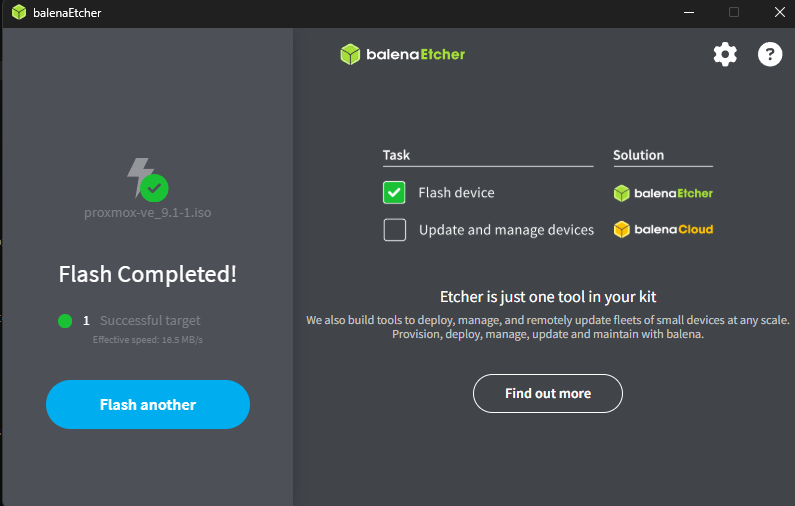

### 1.3 BIOS configuration

Booted the Viglen and entered BIOS by pressing F2. Changed the boot order to prioritise USB boot.

### 1.4 Proxmox installer

Selected the Graphical installation option. Worked through the Proxmox installer:

- Selected target disk: /dev/sda — SanDisk SSD Plus 240GB
- Set country, timezone, and keyboard layout to UK
- Set root password and admin email
- Configured network: hostname set to proxmox.local, IP address 192.168.0.68/24, gateway 192.168.0.1, DNS 8.8.8.8

Installation completed and system rebooted.

### 1.5 Issues encountered during installation

**Issue:** Proxmox web dashboard unreachable after first installation — ping from laptop timed out with no response.

**Cause:** The IP address configured during installation (192.168.0.64) was already assigned to another device on the home network via DHCP, causing an IP conflict. Two devices sharing the same IP address meant neither could communicate correctly on the network.

**Resolution:** Reinstalled Proxmox and configured a different static IP address (192.168.0.68) during the installer network setup stage. Confirmed no conflict by pinging the new address from a laptop before proceeding — ping responded successfully. Dashboard then loaded correctly at https://192.168.0.68:8006.

---

## 2. Initial Proxmox Configuration

### 2.1 Accessing the dashboard

After reboot, accessed the Proxmox web dashboard from laptop browser at:

```
https://192.168.0.68:8006
```

Logged in with username `root` and the password set during installation. Accepted the self-signed certificate warning in the browser.

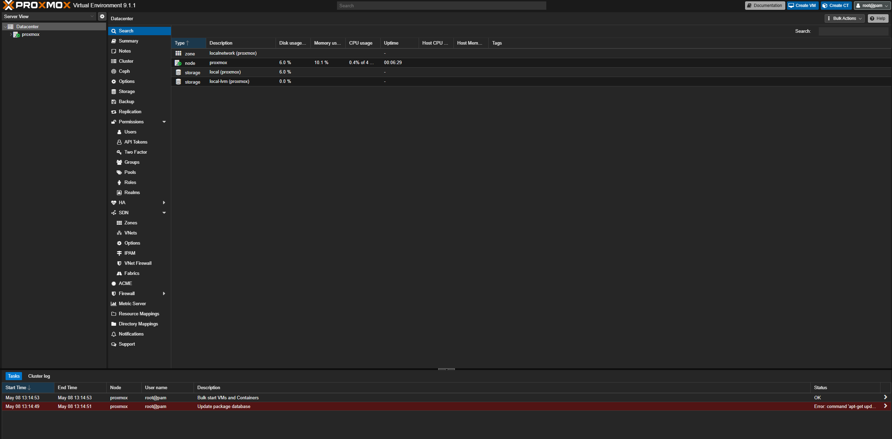

### 2.2 Subscription nag

Proxmox displays a "No valid subscription" warning on login for non-enterprise users. Multiple attempts were made to suppress this via JavaScript modifications to proxmoxlib.js — these were unsuccessful on Proxmox 9.1.1 as the file structure has changed in newer versions. The warning is dismissed manually on each login by clicking OK. This does not affect any functionality.

### 2.3 Updating Proxmox

Updated to the latest packages via the Proxmox shell:

```bash
apt-get update && apt-get upgrade -y
```

---

## 3. Network Configuration

### 3.1 Network design

Two virtual bridges configured in Proxmox:

- **vmbr0** — bridges to the physical ethernet interface, connects to home router. Used by Proxmox itself for management access and any VMs that need internet access.
- **vmbr1** — internal only bridge, no physical interface. Used exclusively by lab VMs. This isolates all lab traffic completely from the real network.

A dnsmasq DHCP server was installed on the Proxmox host to automatically assign IP addresses to VMs on the vmbr1 internal network, removing the need for manual static IP configuration on each VM.

### 3.2 Configuring the bridges

Navigated to: Proxmox dashboard → Node → Network → Create → Linux Bridge

Created vmbr1 with:
- No bridge port (internal only)
- No gateway
- IP address: 192.168.100.1/24 (acts as DHCP server address for internal VMs)

Applied configuration via the Apply Configuration button.

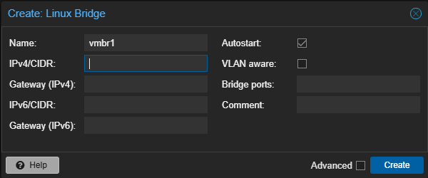

### 3.3 Configuring dnsmasq DHCP for vmbr1

Installed dnsmasq on the Proxmox host to serve DHCP addresses to internal lab VMs:

```bash
apt-get install dnsmasq -y
```

Configured dnsmasq:

```bash
nano /etc/dnsmasq.conf
```

Added the following:

```
interface=vmbr1
dhcp-range=192.168.100.50,192.168.100.200,255.255.255.0,24h
dhcp-option=3
```

Started and enabled dnsmasq:

```bash
systemctl restart dnsmasq
systemctl enable dnsmasq
```

VMs on vmbr1 now automatically receive IP addresses in the 192.168.100.50–200 range on boot.

---

## 4. VM Setup

### 4.1 Uploading ISOs

Navigated to: Datacenter → proxmox → local → ISO Images → Upload

Uploaded the following ISOs:
- Ubuntu Desktop 22.04 LTS (downloaded from ubuntu.com/download/desktop)
- Kali Linux 2026.1 full package Installer ISO (downloaded from kali.org/get-kali — Installer Images section)

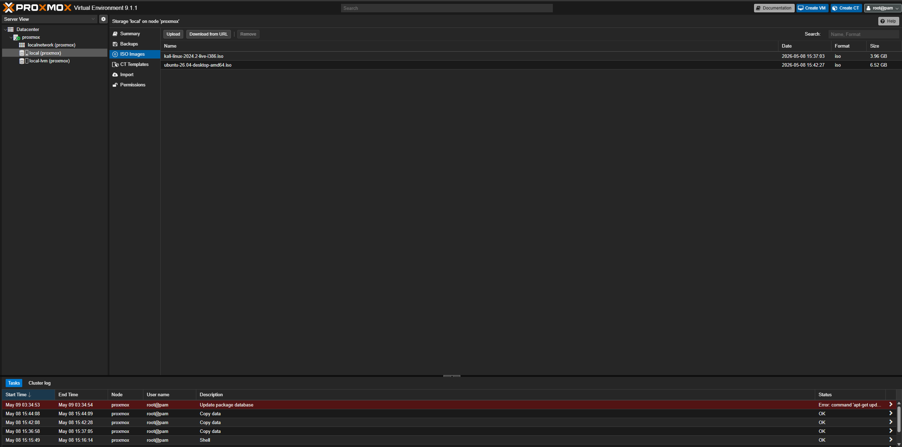

Metasploitable 2 was imported as a pre-built VMDK image rather than installed from an ISO.

---

### 4.2 Ubuntu Desktop VM

**Purpose:** General purpose VM for university coursework, study, and day-to-day use accessible from the lab machine.

**Specs allocated:**

| Setting | Value |
|---------|-------|
| RAM | 4GB |
| CPU | 1 socket, 2 cores |
| Storage | 40GB |
| Display | SPICE, VirtIO-GPU |
| Network | vmbr0 (internet access) |

**Installation:**
Created new VM in Proxmox, attached Ubuntu Desktop ISO, booted and installed. Selected normal installation, set username and password.

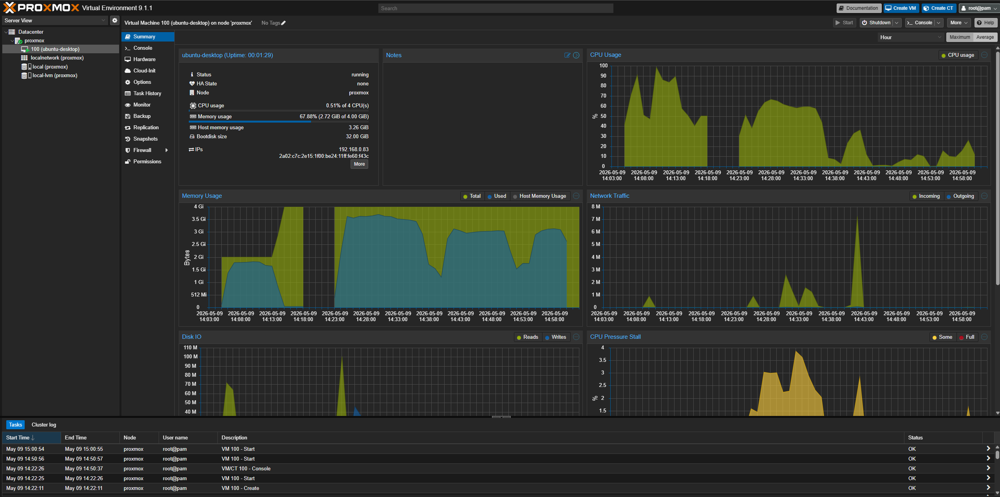

**Issue:** VM performance was slow and laggy. Display resolution limited to basic VGA options with no 2560x1440 support. Windows key and other keyboard shortcuts were being intercepted by the host OS rather than passed to the VM.

**Cause:** Default VM configuration used suboptimal settings — standard VGA display type, incorrect CPU socket/core configuration (2 sockets / 1 core), and insufficient RAM allocation.

**Resolution:** Made the following changes in Proxmox VM Hardware settings:

- **Display:** Changed from default VGA to SPICE with VirtIO-GPU — uses GPU acceleration for rendering rather than software rendering, significantly improving display performance
- **CPU:** Changed from 2 sockets / 1 core to 1 socket / 2 cores — Proxmox performs better with multiple cores on a single socket; multiple sockets implies a multi-CPU server configuration which does not match the hardware
- **RAM:** Increased to 4GB

Installed SPICE client software on the host Windows PC:

- **Virt-Viewer** downloaded from virt-manager.org — required to open SPICE sessions from Proxmox. Proxmox generates a .vv file which Virt-Viewer opens to connect to the VM display
- Inside the Ubuntu VM: `sudo apt-get install qemu-guest-agent spice-vdagent` — enables full resolution support, clipboard sharing between host and VM, and better Proxmox integration
- Enabled QEMU Guest Agent in Proxmox VM Options and rebooted

**Result:** Display now runs at full 2560x1440 resolution with significantly improved performance. SPICE with Virt-Viewer fully captures keyboard and mouse input within the VM window, preventing the Windows key and other shortcuts from being intercepted by the host operating system.

**Additional configuration — Remote Desktop (RDP)**

Following initial SPICE setup, xrdp was installed inside the Ubuntu VM as an alternative access method for improved everyday performance. SPICE introduces display lag at 2560x1440 due to network overhead — RDP uses a more efficient protocol that sends display updates rather than streaming the full screen, resulting in a significantly smoother experience for general desktop use.

Installed xrdp inside Ubuntu:

```bash
sudo apt-get install xrdp -y
sudo systemctl enable xrdp
sudo systemctl start xrdp
```

Connected from host PC using Windows Remote Desktop Connection (run: `mstsc`), entering the Ubuntu VM's IP address. RDP connects directly to the VM over the home network, bypassing the Proxmox console entirely. Proxmox continues to manage the VM in the background but is not involved in the display connection.

**Additional configuration — Audio**

Added an audio device to the Ubuntu VM to enable sound passthrough via SPICE:

Navigated to VM → Hardware → Add → Audio Device. Configured as:
- Audio device: ich9-intel-hda
- Backend driver: SPICE

After rebooting the VM, Ubuntu detected the audio device automatically. Sound now passes through to the host PC speakers via the Virt-Viewer SPICE session.

---

### 4.3 Kali Linux VM

**Purpose:** Attacker machine — primary platform for offensive security practice, TryHackMe, and home lab exercises.

**Specs allocated:**

| Setting | Value |
|---------|-------|
| RAM | 4GB |
| CPU | 1 socket, 2 cores |
| Storage | 42GB |
| Network | vmbr1 (internal only) |

**Installation notes:**
The initial installation attempt used the Kali Live ISO which does not include a desktop environment by default and could not detect the VM disk. This was resolved by downloading the correct full package Kali Installer ISO from kali.org/get-kali (Installer Images section). The full package installer includes all tools and the desktop environment without requiring an internet connection during installation.

During the software selection stage, the following were selected:
- Desktop environment
- Xfce (Kali's default desktop environment)
- top10 — the 10 most popular tools
- default — recommended tools

GNOME was deselected to reduce storage usage.

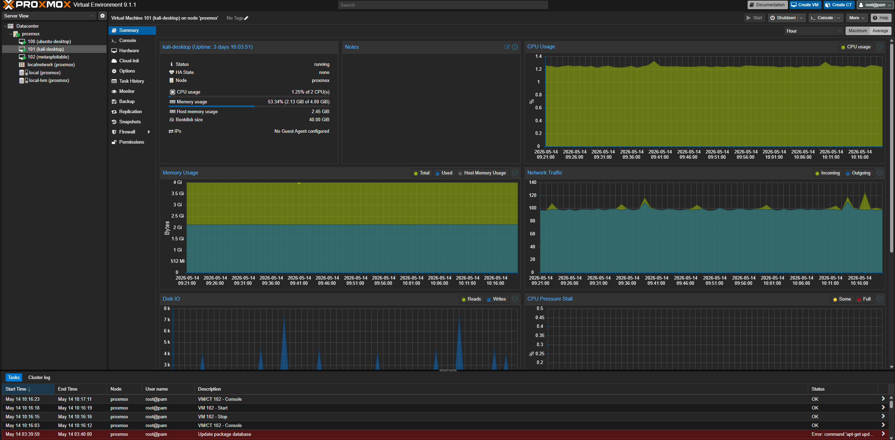

**Issue:** Initial Kali installation booted to a shell with no desktop environment and the VM disk was not detected.

**Cause:** Live ISO used instead of full Installer ISO. The Live ISO does not install a desktop environment and also failed to detect the VM disk during installation.

**Resolution:** Reinstalled from the correct full package Kali Installer ISO. Desktop environment and Xfce selected during software selection. No internet connection required as all packages are included in the full installer.

---

### 4.4 Metasploitable 2 VM

**Purpose:** Deliberately vulnerable Linux target machine for exploitation practice.

**Download:** Downloaded pre-built VMDK image from SourceForge. Transferred to Proxmox via SCP from host PC:

```bash
scp C:\Users\Harri\Downloads\Metasploitable\meta-l4.vmdk root@192.168.0.68:/var/lib/vz/import/
```

**Import to Proxmox:**

```bash
qm create 102 --name metasploitable --memory 512 --cores 1 --net0 virtio,bridge=vmbr1
qm importdisk 102 /var/lib/vz/import/meta-l4.vmdk local-lvm --format qcow2
```

After import, navigated to VM 102 → Hardware → Unused Disk 0 → double clicked → Add. Then Options → Boot Order → set disk as first boot device.

**Specs allocated:**

| Setting | Value |
|---------|-------|
| RAM | 512MB |
| CPU | 1 socket, 1 core |
| Storage | imported VMDK |
| Network | vmbr1 (internal only) |

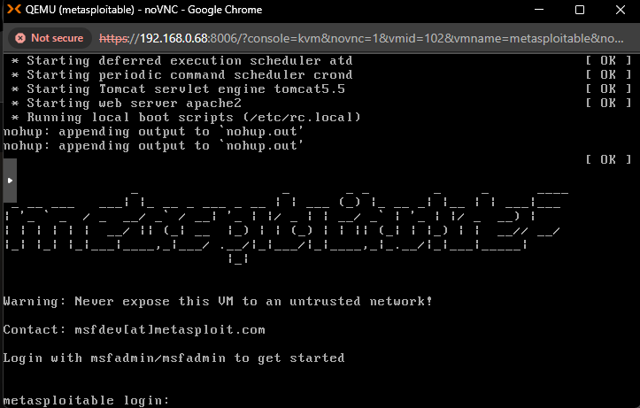

**Default credentials:** msfadmin / msfadmin

**Important:** This VM is intentionally vulnerable and must never be connected to vmbr0 or the internet. Internal network only at all times.

---

## 5. Verifying the Lab

### 5.1 Confirming DHCP on vmbr1

After dnsmasq was configured, both Kali and Metasploitable were rebooted. Both received automatic IP addresses in the 192.168.100.x range from the dnsmasq DHCP server running on the Proxmox host.

Verified on Kali with:

```bash
ip a
```

Kali received: 192.168.100.168/24

Verified on Metasploitable by logging in with msfadmin/msfadmin and running:

```bash
ifconfig
```

Metasploitable received: 192.168.100.123/24

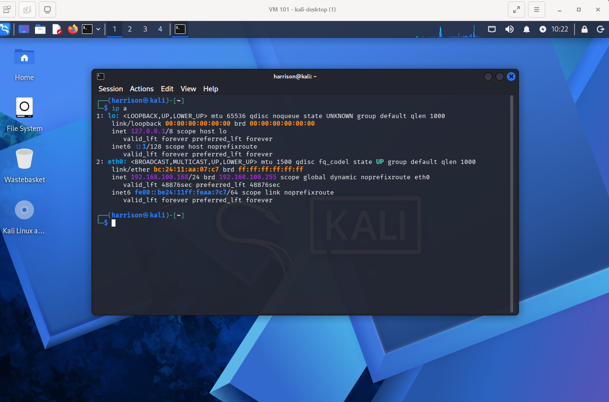

### 5.2 Connectivity test

From Kali, confirmed connectivity to Metasploitable:

```bash
ping 192.168.100.123
```

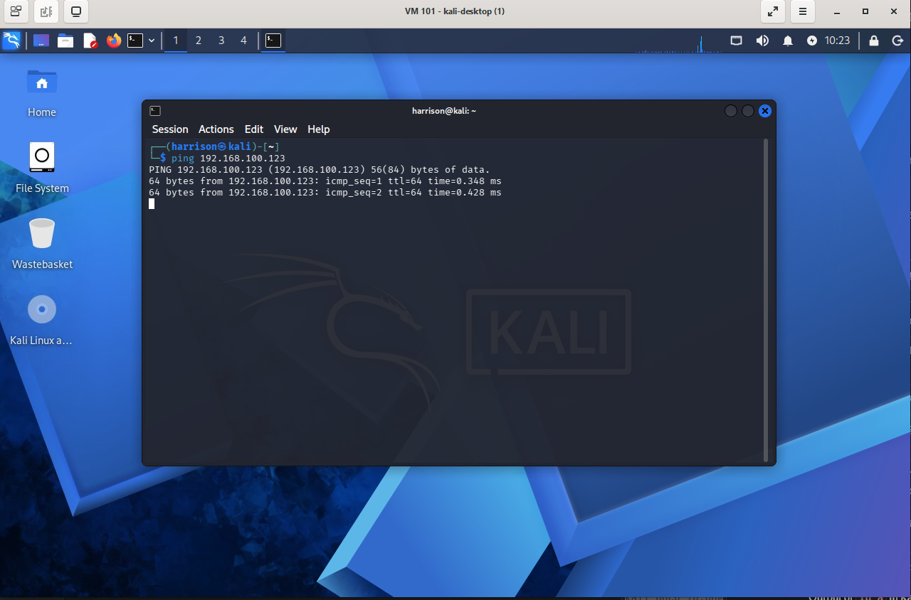

Confirmed Kali cannot reach the internet (as expected — vmbr1 only, no gateway configured):

```bash
ping 8.8.8.8
```

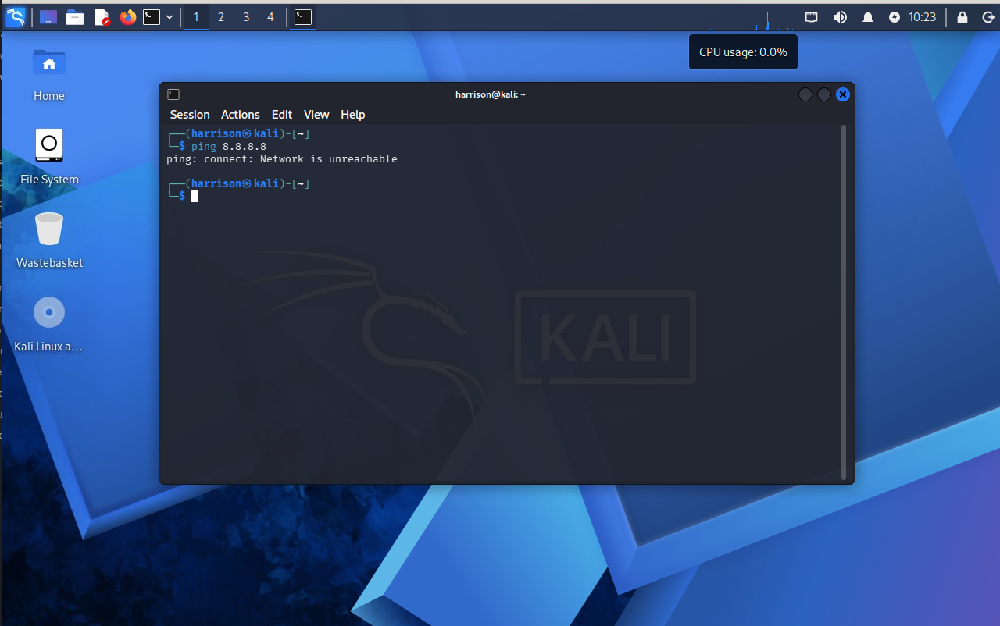

### 5.3 First Nmap scan

Ran initial Nmap scan from Kali against Metasploitable to confirm lab is working end to end:

```bash
nmap -sV -sC 192.168.100.123
```

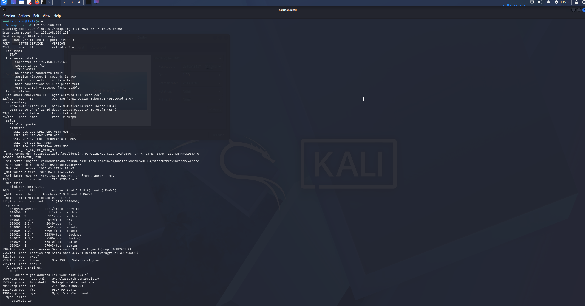

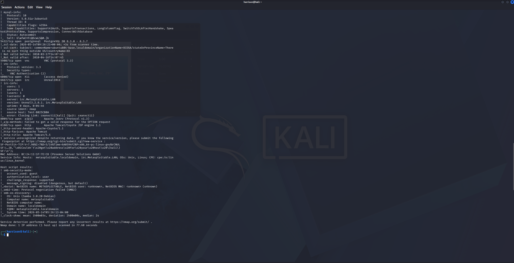

This confirms the lab is fully operational. Full exploitation exercises are documented in the /writeups/ folder.

---

## 6. Issues and Resolutions Log

**Issue 1:** IP conflict on first Proxmox installation
**Cause:** Static IP 192.168.0.64 was already assigned to another device on the home network via DHCP.
**Resolution:** Reinstalled Proxmox with IP 192.168.0.68 which had no conflict.

---

**Issue 2:** Proxmox subscription nag could not be removed
**Cause:** Proxmox 9.1.1 changed the structure of proxmoxlib.js — previously documented sed commands no longer work correctly on this version.
**Resolution:** Nag is dismissed manually on each login by clicking OK. No functionality is affected.

---

**Issue 3:** Ubuntu VM display slow and laggy, limited to low resolutions, keyboard not captured
**Cause:** Default VGA display type, incorrect CPU socket configuration (2 sockets / 1 core), and insufficient RAM.
**Resolution:** Changed display to SPICE/VirtIO-GPU, changed CPU to 1 socket / 2 cores, increased RAM to 4GB, installed Virt-Viewer on host PC and spice-vdagent inside VM. xrdp subsequently installed for improved everyday desktop performance.

---

**Issue 4:** Kali Linux booted to shell with no desktop environment, VM disk not detected
**Cause:** Live ISO used instead of full Installer ISO. The Live ISO does not install a desktop environment and failed to detect the VM disk.
**Resolution:** Reinstalled from the correct full package Kali Installer ISO. Desktop environment and Xfce selected during software selection. No internet connection required as all packages are included in the full installer.

---

**Issue 5:** Kali and Metasploitable had no IP addresses on vmbr1
**Cause:** vmbr1 is an internal bridge with no DHCP server — VMs received no automatic IP addresses on boot.
**Resolution:** Installed dnsmasq on Proxmox host and configured it to serve DHCP on vmbr1 with range 192.168.100.50–200. Both VMs now receive IP addresses automatically on boot.

---

## 7. Next Steps

- [x] Proxmox VE installed and accessible
- [x] Ubuntu Desktop VM running at full resolution
- [x] Ubuntu accessible via RDP for improved performance
- [x] Kali Linux VM running with full desktop and tools
- [x] Metasploitable 2 VM running
- [x] Internal network (vmbr1) configured with DHCP via dnsmasq
- [x] Kali to Metasploitable connectivity confirmed
- [x] First Nmap scan completed
- [ ] Add Ubuntu Server VM for Elastic SIEM (Elasticsearch + Kibana)
- [ ] Install Elastic Agent on Metasploitable to forward logs to SIEM
- [ ] Configure detection rules in Kibana mapped to MITRE ATT&CK
- [ ] Complete first attack/detect exercise and document with ATT&CK mapping
- [ ] Add DVWA for web application attack practice
- [ ] Set up WireGuard VPN for remote access

---

## References

- Proxmox VE documentation: pve.proxmox.com/wiki
- Kali Linux documentation: kali.org/docs
- Metasploitable 2: sourceforge.net/projects/metasploitable
- Ubuntu Desktop: ubuntu.com/download/desktop
- dnsmasq documentation: thekelleys.org.uk/dnsmasq/doc.html
- xrdp documentation: xrdp.org